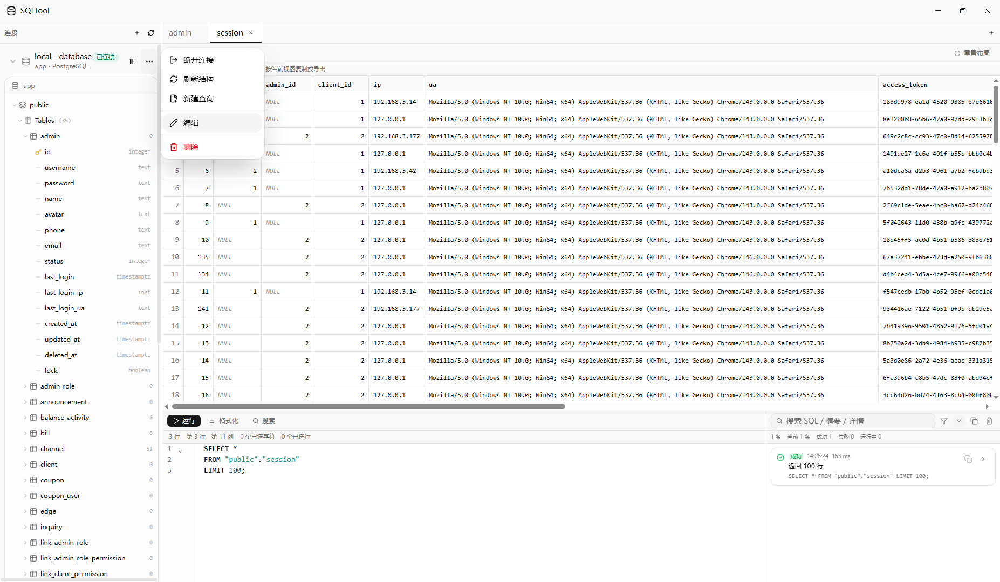
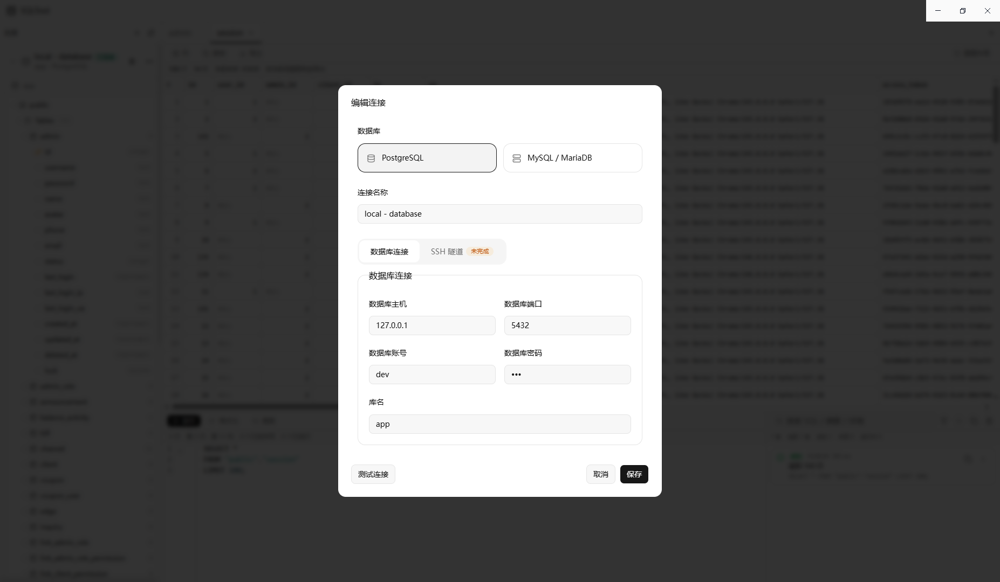

# SqlTool

A simple SQL client built with React and Electron.

## TODO

### 问题

- 编辑连接时，默认会在 ssh 表单的 port 给出默认值 22，导致未配置 ssh 的连接因为没有正确填写表单而无法保存
- 编辑连接时，ssh 区域放宽检查，当认证方式为私钥时，允许只提供 host，此时可视为使用 alias 连接
- 隐式处理连接与关闭：执行需要连接的操作时，自动检查连接状态并在必要时建立连接；当连接不再需要时，自动关闭连接
  - 编辑连接时，如果未关闭连接，提示用户是否关闭连接
- 无法拖动 appbar 调整窗口位置
- table 高亮选中行时，正常cell的文字会显示在pinned文字的上方
- push 之前检查版本是否正确

### 整体功能

- 检查并自动更新
- 快捷键管理
- 考虑实现 i18n
- 支持运行日志记录

### sidebar

- 实现全局长连接，tabs 里执行语句前先打开长连接，不再使用临时连接

### tabbar

- 拖拽排序
- 右键菜单：关闭、关闭其他、关闭左侧、关闭右侧、固定/取消固定
- 状态持久化

### Code Area

- 无连接 tab 默认通用 sql
- 自动补全
- 语法诊断
- 常用片段

建议依赖：

- `@codemirror/autocomplete`
- `@codemirror/lint`

### Table Area

- 可编辑表格
- 超大结果集提示
- 虚拟列表
- 提供更多列元数据
- 按类型渲染优化

建议依赖：

- `@tanstack/react-virtual`
